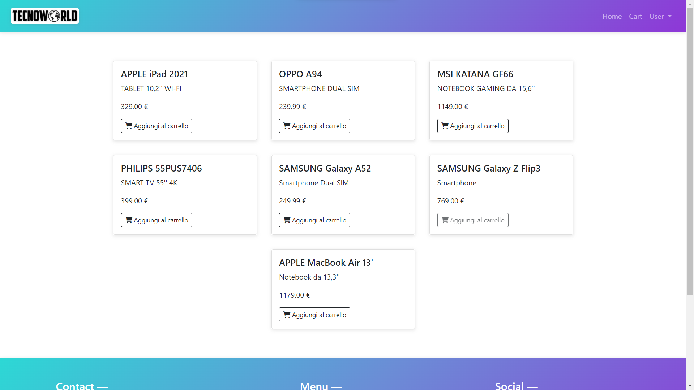

# Fullstack Project

This project is a fullstack web app, and is practically an ecommerce back office.

## Getting Started

To Starting using this Application locally download the project and rename the ".env.sample" file in ".env" in the "laravel_api" file and edit this with your database name. 
So you can open the "laravel_api" file in your favourite IDE or editor, open the terminal and run "php artisan serve" command. So open the "fullstack_project" file and in the terminal run "ng serve" command. Then open your favorite browser and go to this link (http://localhost:4200/). 

## Tools Used

Node npm

React

Netlify

Rest Api

## Usage

The usage is very simple, you can see crypto prices, you can select your favorites, and by clicking on it you can see more information about the crypto.

## Contact
Email: rey.hossa.rh@gmail.com

Project link: https://github.com/rey-hossa/CryptoCoin.git
